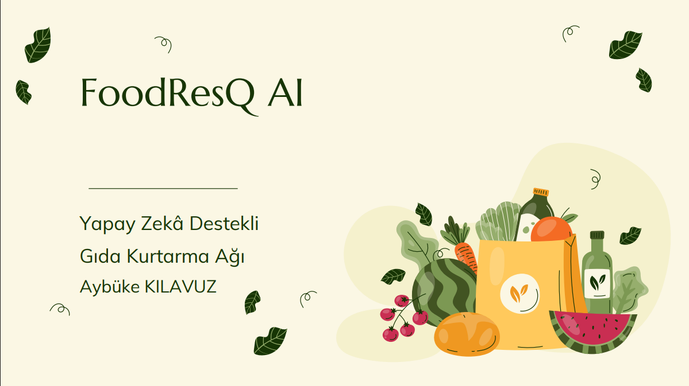
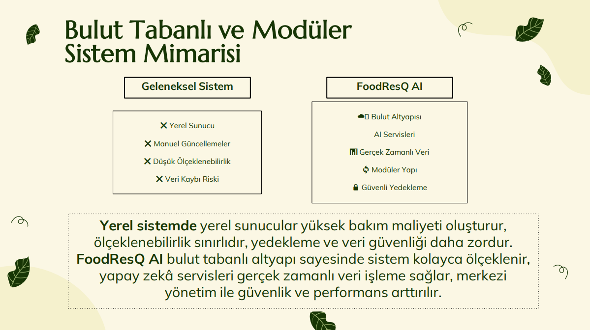
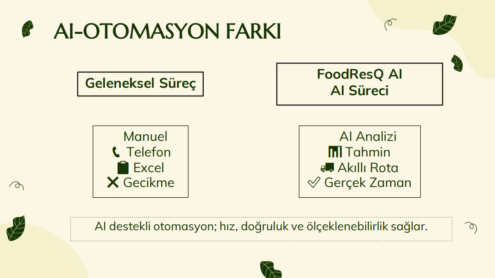
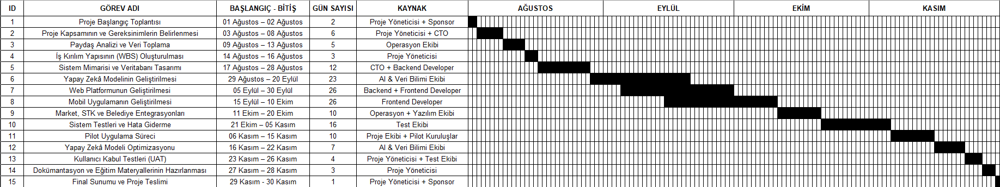
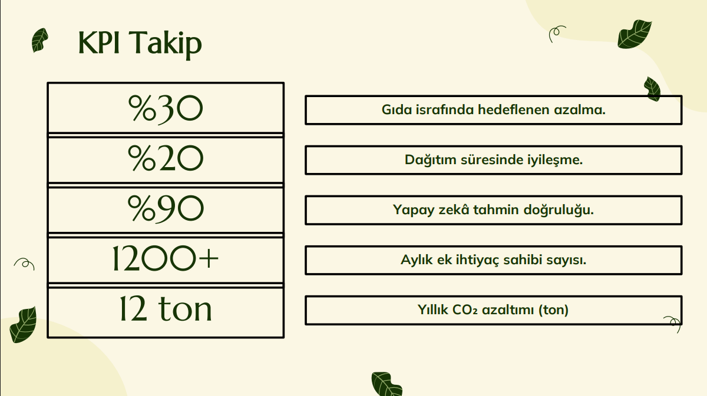
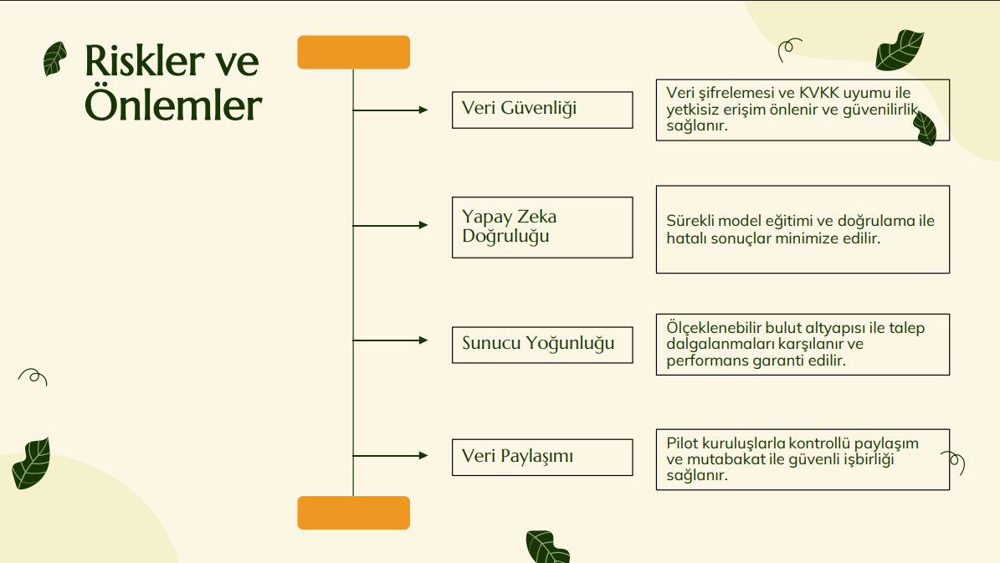

<p align="center">
  
</p>

# 🍎 FoodResQ AI
### AI-Powered Food Rescue Network
#### Project Management Case Study

> An AI-powered food rescue network designed to reduce food waste by intelligently matching surplus food with organizations in need through data-driven decision support.

---

## 📌 Project Overview

FoodResQ AI is a project management case study developed during the **SCA Social & TNC Group Online Project Management Internship Program**.

The project proposes an artificial intelligence-supported platform that helps reduce food waste by connecting supermarkets, restaurants, hotels and bakeries with charities and food banks. Instead of relying on manual coordination, the platform analyzes available food, predicts demand, recommends the most suitable recipient organization and optimizes delivery routes.

The project focuses on both **project management methodology** and **AI-driven solution design**.

---

# 🎯 Project Objectives

- Reduce food waste
- Improve food donation efficiency
- Support sustainable development
- Optimize logistics operations
- Increase operational efficiency using Artificial Intelligence
- Provide a scalable decision support system

---

# 🚨 Problem Statement

Millions of tons of edible food are wasted every year while many people still struggle to access sufficient nutrition.

Current donation processes are often:

- Manual
- Slow
- Difficult to coordinate
- Inefficient
- Unable to prioritize urgent donations

FoodResQ AI addresses these challenges by introducing intelligent automation into the donation process.

---

# 💡 Proposed Solution

The proposed platform performs the following tasks:

- Collects donation information from businesses
- Analyzes product expiration dates
- Predicts regional demand using Machine Learning
- Matches donations with the most appropriate charity
- Optimizes transportation routes
- Generates operational reports

---

# 🤖 Artificial Intelligence Features

The project incorporates multiple AI techniques including:

- Machine Learning
- Predictive Analytics
- Recommendation Systems
- Route Optimization
- Data Analytics
- Decision Support Systems

These technologies enable faster, smarter and more sustainable food donation management.

---

# 📊 Key Performance Indicators (KPIs)

| KPI | Target |
|------|---------|
| Food Waste Reduction | 30% |
| Route Efficiency Improvement | 20% |
| AI Matching Accuracy | 90%+ |
| Delivery Time | Under 2 Hours |
| User Satisfaction | 85%+ |

---

# 🏗 System Architecture

<p align="center">

</p>

The proposed architecture integrates:

- Food Donation Sources
- AI Decision Engine
- Database
- Logistics Module
- Charity Management
- Reporting System

---

# 🔄 Workflow

<p align="center">

</p>

The workflow demonstrates how donated products move from businesses to beneficiaries through AI-assisted decision making.

---

# 📅 Project Timeline

<p align="center">

</p>

The project was planned using a structured Gantt schedule covering planning, analysis, implementation and evaluation phases.

---

# 📈 Performance Dashboard

<p align="center">

</p>

The dashboard summarizes the expected project outcomes and success metrics.

---

# ⚠ Risk Management

<p align="center">

</p>

Major project risks include:

- Data quality
- Limited historical data
- Infrastructure costs
- User adaptation
- Information security

Mitigation strategies were prepared for each identified risk.

---

# 📂 Repository Structure

```
FoodResQ-AI-Project-Management-Case-Study
│
├── Documentation
│   └── Final_Project_Report.pdf
│
├── Images
│
├── Presentation
│   └── FoodResQ_AI_Presentation.pdf
│
├── Project-Management
│   ├── Project_Charter.pdf
│   ├── Organization_Handbook.pdf
│   └── Gantt_Chart.xlsx
│
└── README.md
```

---

# 📄 Project Documents

This repository contains:

- Project Charter
- Organization Handbook
- Final Project Report
- Presentation
- Gantt Chart
- AI Architecture
- Risk Assessment
- KPI Definition
- Project Planning Documents

---

# 🛠 Skills Demonstrated

- Project Management
- Artificial Intelligence
- Business Analysis
- Documentation
- Risk Management
- Strategic Planning
- KPI Development
- System Design
- Data Analysis
- Sustainability Planning

---

# 🚀 Future Improvements

Potential future enhancements include:

- Mobile application
- Real-time donation tracking
- Carbon footprint analysis
- Volunteer management system
- IoT integration
- Cloud deployment
- Advanced AI prediction models

---

# 🌍 Sustainable Development Goals

This project supports:

- SDG 2 – Zero Hunger
- SDG 12 – Responsible Consumption and Production
- SDG 13 – Climate Action

---

# 👩 Author

**Aybüke**

Computer Engineering Student

Project developed during the **SCA Social & TNC Group Online Project Management Internship Program**.

---

## ⭐ Thank you for visiting this repository!

If you found this project interesting, feel free to explore the documentation and presentation included in this repository.
